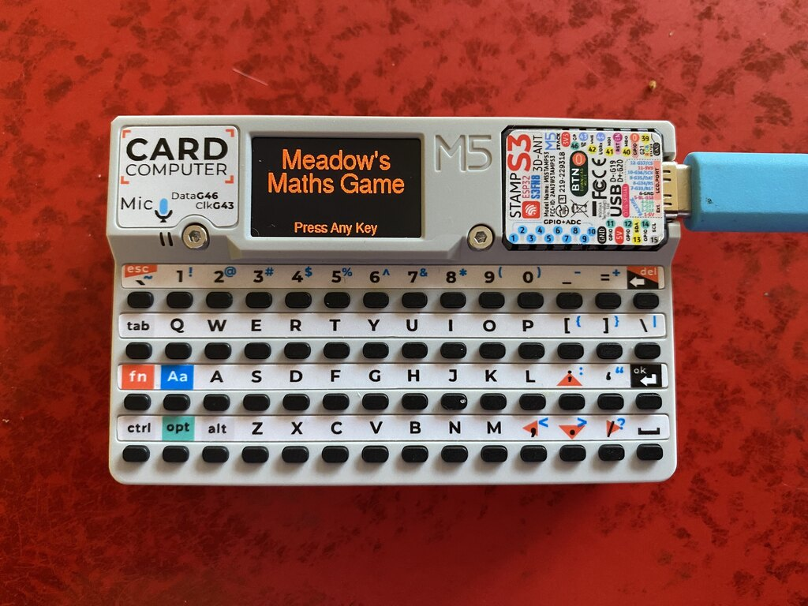
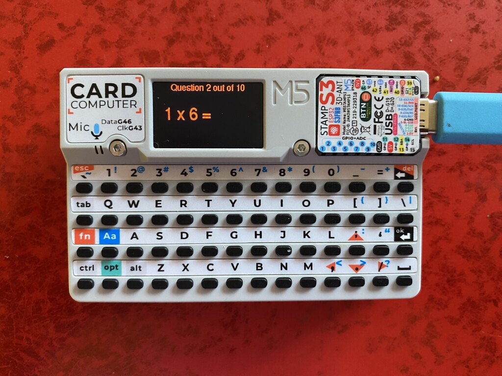
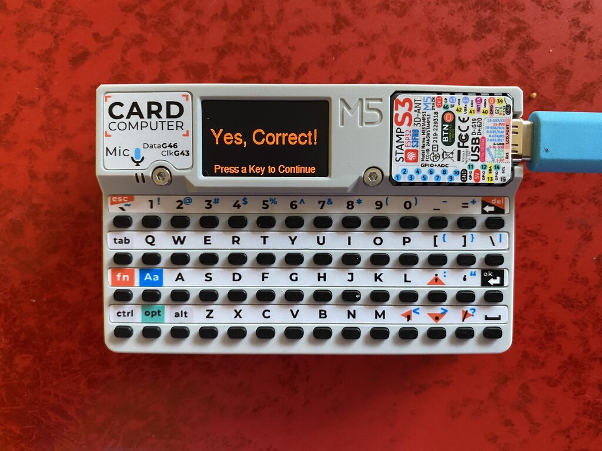

# M5 Cardputer Math Game

A maths game written for the new [M5 Cardputer](https://docs.m5stack.com/en/core/Cardputer). Suitable for a primary/middle schooler

- Version 0.1
    - Asks you multiplication questions in groups of 10 
    - Tells you if you are correct or not.
    - Counts your progress through the batch
    - At the end tells you the score
    - Sparkles for a High Score!

- 
- 
- 

I like this approach because I can give it to my offspring, the games are focussed on her needs, also there is no internet or other similar distractions.