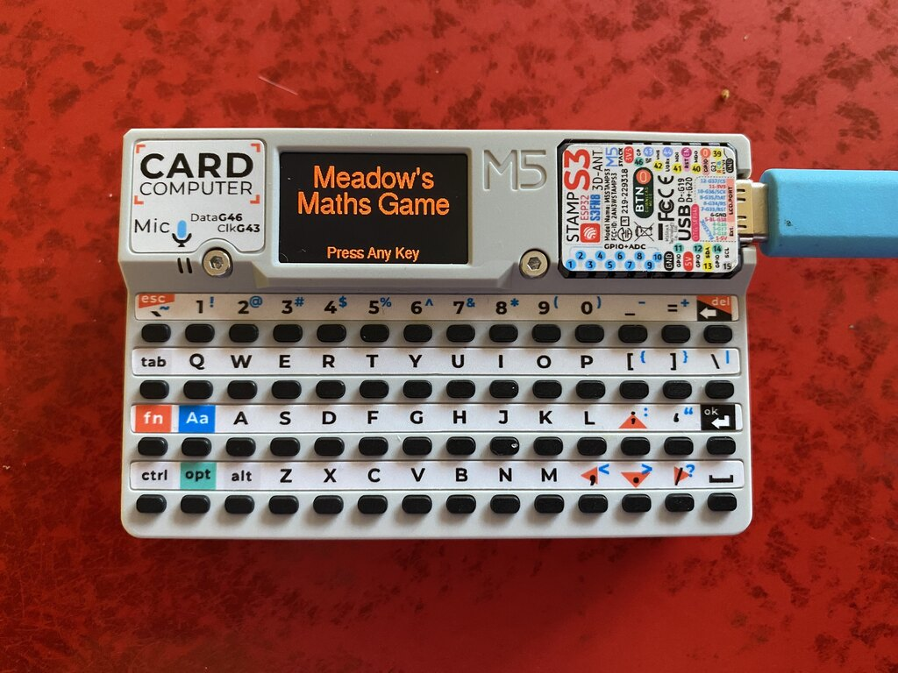
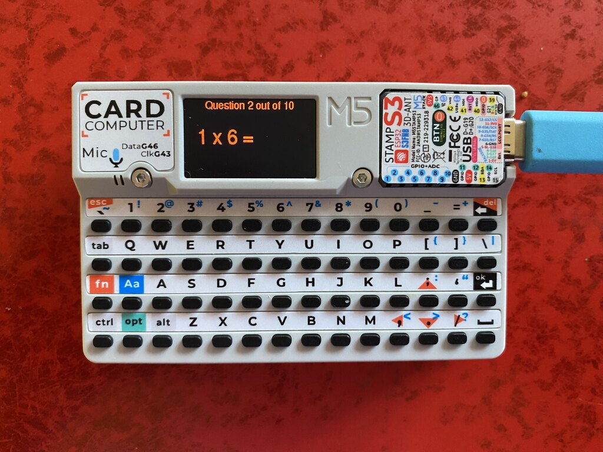
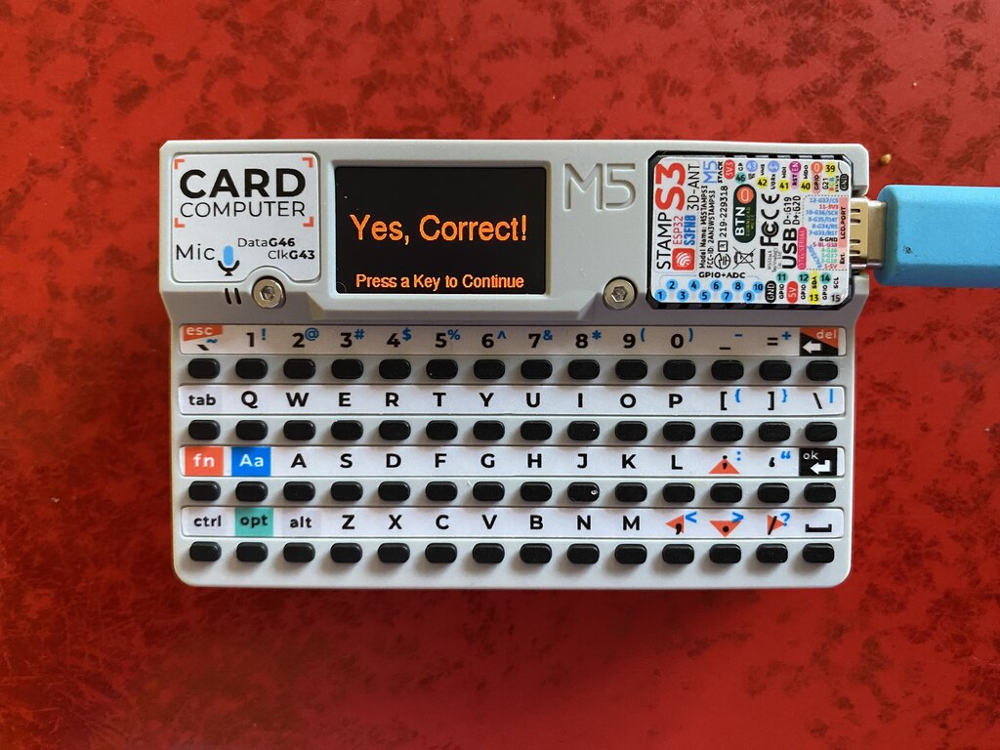

# M5CardputerMathGame

A maths game written for the new [M5 Cardputer](https://docs.m5stack.com/en/core/Cardputer
).

Currently asks random times tables questions in sets of 10, if you get more than 9 right there are some sparkles.

I like this approach because I can give it to my offsprint, the games are focussed on her needs, also there is no internet or other similar distractions.